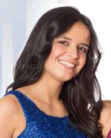
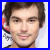

# K3-Op-Een-Rij FAQ

## Who are these images?

Image|Name
---|---
 | David 
 | Hanne Verbruggen
 | Josje Huisman
 | Karen Damen
 | Kathleen Aerts
 | Klaasje Meijer
 | Kristel Verbeke
 | Matt
 | Marthe De Pillecyn
 | Tyler 

## Why the male images?

Because gender equality.

## How were the male images selected?

This was done by a randomly sampled female.
