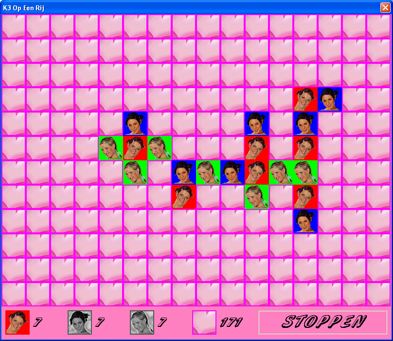

# K3-Op-Een-Rij

K3-themed game of connect-three programmed in C++ using Qt and Wt (see 'About the program' for more details).

# Downloads

 * [Download the Windows executable](http://richelbilderbeek.nl/GameK3OpEenRij.zip)

# About the program

K3-Op-Een-Rij is programmed in C++14 using the STL, Boost, [Qt](http://www.qt.io) (for the desktop version) and [Wt](http://www.webtoolkit.eu/wt) (for the website version) libraries.

K3-Op-Een-Rij is cross-compiled using [MXE](http://mxe.cc) in the bash shell scripts.

# I want to contribute!

Awesome!

You can collaborate by
 * email richelbilderbeek (at [Richel Bilderbeek's webpage its 'Contact Me' section](http://www.richelbilderbeek.nl/Contact.htm))
 * add a GitHub issue: this can be a question, suggestion, or whatever
 * fork this repository, make the changes, and submit a pull request. 

# Screenshot archive

The most recent screenshots are at the top.

